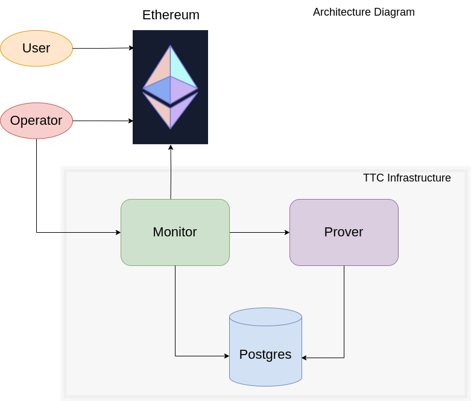
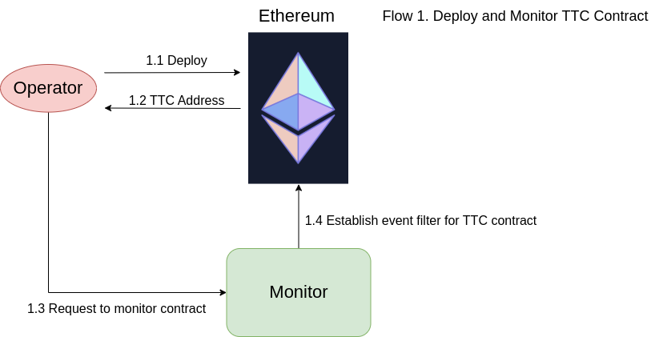
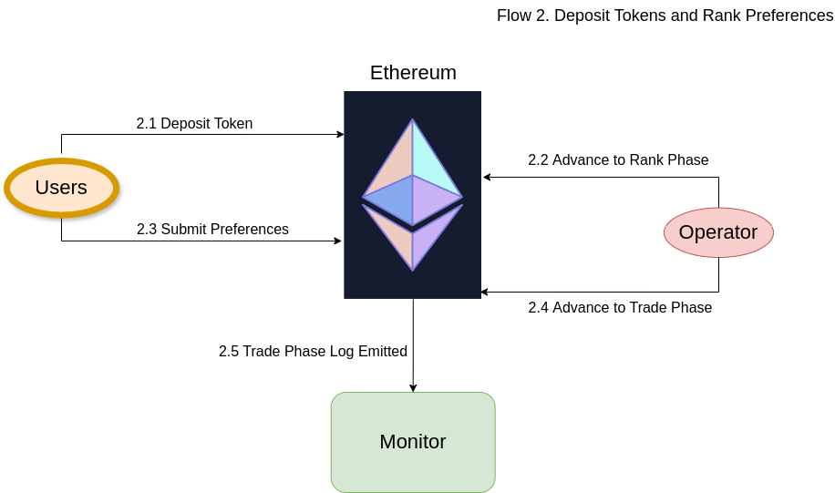
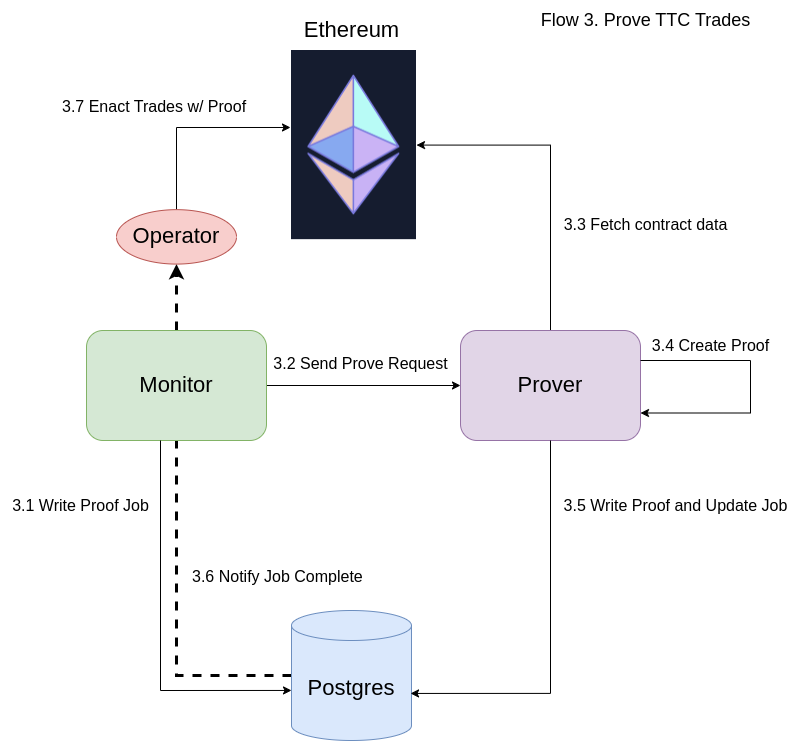
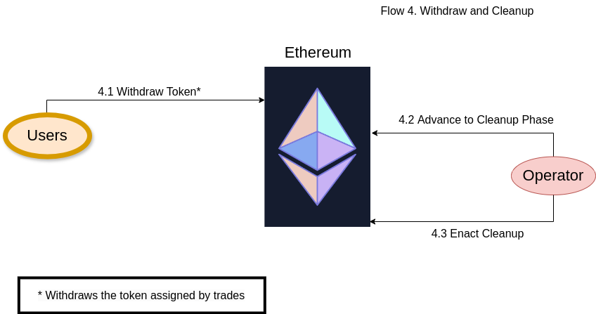

# Architecture Diagram
The TTC architecture consists of 2 hosted services (`Monitor` and `Prover`) and a shared Postgres database:

  

The `Monitor` exposes a public facing JSON-RPC api with a [few methods](./monitor/api/src/rpc.rs). The `Monitor` has
access to the `Prover` service, but the `Prover` service exposes no public api.

The `Monitor` runs on an extremely basic VM, the `Prover` runs on a GPU enabled VM 
(currently using an [L4](https://www.nvidia.com/en-us/data-center/l4/) instance on GCP)

# Flows

## Deployment Flow.

The `Operator` deploys the contracts and submits the address to the `Monitor` service. This spawns an event monitor loop looking for
contract updates in the `TTC` contract. The loop will run until the termination criteria is realized, either
 - The contract is ready for proof generation
 - The proof request has timed out (after 250 blocks)

  

## User Input Flow

The contract is initialized in the `Deposit` phase. The duration of the phase is configurable at contract deployment. During this time
`User`s may deposit ERC-721 tokens into the contract. 

After the `Deposit` phase is completed, the `Operator` (or any other actor) can transition the contract to the `Rank` Phase. 
At this time the deposits are locked and the users can submit their trading preferences. The duration of this phase is configured 
at deployment.

After the `Rank` phase is completed, the contract is transitioned into the `Trade` phase. The preferences are locked and the contract
emits an event for the `Monitor` service to act on.

  

## Prove and Trade Flow

The `Monitor` will write a job to the database indicating that there is proof work to do. It then sends a request to the prover to
wake up and do the proving work.

When the prover completes, it updates the job status and writes the proof to the database. This modification triggers a Postrges 
listen/notify channel, which alerts the monitor and anyone else listening for this status update (i.e. e.g. `Operator`). 

The `Operator` can then post the trades with proof to the chain, which will enact the trades within the contract and progress the phase
to `Withdraw`. If no proof is posted within a 250 block window, anyone can manually update the phase to `Withdraw`.

  

## Withdraw and Exit Flow

The `User`s can now withdraw their tokens, which are reflected by the trade results. 

After all the tokens are withdrawn, the contract enters a `Cleanup` phase. At this point the `Operator` can collect 
any fees earnd by the contract.

  

